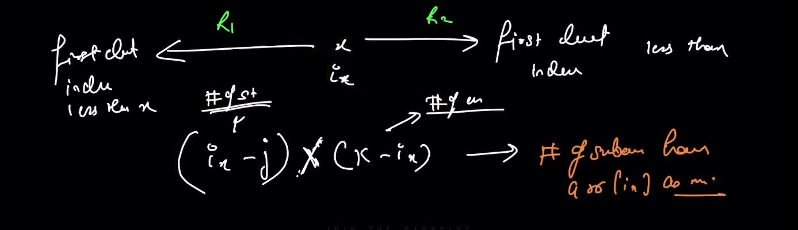

## Stack

### 1. Basics

> Linear data structure

> data can be only accessed from one end of the stack (LIFO Last In First Out)

> Apart from the topmost element , no other element is directly accessible in the stack.

> Application of stacks

1. LIFO
2. Back button layout navigation implementation in mobile App
3. Balance paranthesis

#### 1. Implementation of Stack using LL

push -> add -> add at head O(1)

pop -> remove -> delete from head O(1)

#### 2. Implementation of Stack using Array

push O(1)
pop O(1)

#### 3. Implementation of Stack using Queue

#### 4. Method to insert at bottom in stack using stack method (Time and space need not to be O(1))

` insertAtBottom(stack,x)`

> 1. Remove all ele one by one and back them up (in another stack)
> 2. Add x to the empty stack
> 3. insert the backed up ele in the same order
>    T -> O(n), S -> O(n)

pseudo code

```
insertAtBottom(stack,x){
    temp <- temp stack
    while(not st.empty()){
        temp.push(st.top);
        st.pop();
    }
    st.push(x);
    while(not temp.empty()){
        st.push(st.top);
        temp.pop();
    }
}
```

#### 5. Reversing a stack (transform the original stack)

pseudo code using recursion

```
reverse(st){
    if(st.empty()){
        return;
    }
    el=st.top;
    st.pop();
    reverse(st); // recursive call
    insertAtBottom(st,el);
}
```

`JS Code`

```
function insertAtBottom(st,x){
    let temp=[];
    while(st.length!==0){
        let el=st[st.length-1];
        temp.push(el);
        st.pop();
    }
    st.push(x);
    while(temp.length!==0){
        let el=temp[temp.length-1];
        st.push(el);
        temp.pop();
    }
}
```

Note : For every ele, we are calling insertAtBottom
T -> O(n\*n) -> O(n^2)
S -> O(n) -> recursive stack space

`JS implementation`

```
function insertAtBottom(st,x){
    let temp=[];
    while(st.length!==0){
        let el=st[st.length-1];
        temp.push(el);
        st.pop();
    }
    st.push(x);
    while(temp.length!==0){
        let el=temp[temp.length-1];
        st.push(el);
        temp.pop();
    }
}

function reverse(st){
    if(st.length===0) return;
    let el=st[st.length-1];
    st.pop();
    reverse(st);
    insertAtBottom(st,x);
    return;
}
```

#### 6. Valid parantheses (Easy)

Link: https://leetcode.com/problems/valid-parentheses/

T -> O(n)
S -> O(n)
`CPP code`

```
1.
class Solution {
public:
   bool isValid(string s) {
       stack<char> st;
       int n=s.size();
       if(n==1) return false;
       for(auto e:s){
           if(e=='(' || e=='{' || e=='['){
               st.push(e);
           }
           else if(!st.empty()){
               char top=st.top();
               if(e==')' && top=='(') st.pop();
               else if(e=='}' && top=='{') st.pop();
               else if(e==']' && top=='[') st.pop();
               else return false;
           }
           else return false;
       }
       return st.empty()==true;
   }
};

2.
class Solution {
public:
   bool isValid(string s) {
       int n=s.size();
       unordered_map<char,int> m={{'(',-1},{'{',-2},{'[',-3},{')',1},{'}',2},{']',3}};
       stack<char> st;
       for(auto e:s){
           if(m[e]<0) st.push(e);
           else{
               if(st.empty()) return false;
               char top=st.top();
               st.pop();
               if(m[top]+m[e]!=0) return false;
           }
       }
       return st.empty();
   }
};
```

`Python code`

```
1.
class Solution:
   def isValid(self, s: str) -> bool:
       stack = []
       for char in s:
           if char == '(' or char == '{' or char == '[':
               stack.append(char)
           else:
               if not stack:
                   return False
               if char == ')' and stack[-1] == '(':
                   stack.pop()
               elif char == '}' and stack[-1] == '{':
                   stack.pop()
               elif char == ']' and stack[-1] == '[':
                   stack.pop()
               else:
                   return False
       return len(stack)==0

2.
class Solution:
   def isValid(self, s: str) -> bool:
       myset={'{':-1,'}':1,'(':-2,')':2,'[':-3,']':3}
       stack=[]
       for ele in s:
           if myset[ele]<0:
               stack.append(ele)
           else:
               if len(stack)==0:
                   return False
               else:
                   if myset[stack.pop()]+myset[ele]!=0:
                       return False
       return len(stack)==0

3.
class Solution(object):
   def isValid(self, s):
       """
       :type s: str
       :rtype: bool
       """
       myset={'{':-1,'}':1,'(':-2,')':2,'[':-3,']':3}
       ct=0
       stack=[]
       for brace in s:
           if myset[brace] is -1 or myset[brace] is -2 or myset[brace] is -3:
               stack.append(myset[brace])
               ct+=myset[brace]
           else:
               if len(stack)!=0:
                   end=stack.pop()
                   if end+myset[brace]!=0:
                       return False
                   else:
                       ct+=myset[brace]
               else:
                   return False
       return ct==0

```

`JS code`

```
/**
* @param {string} s
* @return {boolean}
*/
var isValid = function(s) {

   let st=[];
   for(let i=0;i<s.length;i++){
       if(s[i]=='(' || s[i]=='{' || s[i]=='['){
           st.push(s[i]);
       }else{
           let currClosing=s[i];
           if(currClosing == ')' && st[st.length-1]!='(') {
               return false;
           }
           if(currClosing == ']' && st[st.length-1]!='[') {
               return false;
           }
           if(currClosing == '}' && st[st.length-1]!='{') {
               return false;
           }
           if(st.length==0) {
               return false;
           }
           st.pop();
       }
   }
   return st.length==0;

};

```

### 2. Monotonic Stack

#### 1. Next greater element

Link `https://leetcode.com/problems/next-greater-element-i/`
Link: `https://leetcode.com/problems/next-greater-element-ii/description/`

Brute Force pseudo code

T->O(n^2)
S->O(n)

```
for(i=0;i<n;i++>{
    for(j=i+1;j<n;j++>{
        if(a[j]>a[i]){
            output[i]=a[j];
            break;
        }
    })
})
```

CPP code

```
1.
class Solution {
public:
    vector<int> nextGreaterElement(vector<int>& nums1, vector<int>& nums2) {
        int n=nums1.size();
        int m=nums2.size();
        vector<int> ans;
        for(int i=0;i<n;i++){
            auto j=find(nums2.begin(),nums2.end(),nums1[i])-nums2.begin();
            int k;
            for(k=j;k<m;k++){
                if(nums2[k]>nums2[j]){
                    ans.push_back(nums2[k]);
                    break;
                }
            }
            if(k==m) ans.push_back(-1);

        }
        return ans;
    }
};
```

Python code

```
class Solution:
    def nextGreaterElement(self, nums1: List[int], nums2: List[int]) -> List[int]:
        ans=[]
        for n1 in nums1:
            ind=nums2.index(n1)
            i=ind
            while i<len(nums2):
                if n1<nums2[i]:
                    ans.append(nums2[i])
                    break
                else:
                    i+=1
            if i==len(nums2):
                ans.append(-1)
        return ans
```

JS Code using stack
Link: `https://leetcode.com/problems/next-greater-element-ii/description/`


> 1. first element to the right of curr ele greater than curr ele
> 2. for inc part/curve -> curr -> a[i+1]>a[i] so, a[i+1] is the ans for a[i]
> 3. But we can't say that for sure for decreasing curve
> 4. After the dip curve, when we get an increasing curve the element of increasing curve might help us to get ans
> 5. We will store the elements of decreasing curve because their ans will come later
> 6. x -> inc curve -> x will be definately the ans of prev ele
> 7. keep tracking of last visited ele
> 8. whenever you get decreasing curve store in the stack
>    Store the index in stack
>    T -> O(2\*n) -> O(n) at max 2 operation for each ele
>    S -> O(n)

```
function nge(arr){
    let n=arr.length;
    let output=Array(n);
    let st=[];
    st.push(0);//store index
    for(let i=1;i<n;i++){
        while( st.length>0 && arr[i]>arr[st[st.length-1]]){
            output[st[st.length-1]]=arr[i];
            st.pop();
        }
        st.push(i);

    }
    while(st.length>0){
        let topOfStack=st[st.length-1];
        output[topOfStack]=-1;
        st.pop();

    }
    return output;
}

```

`Python code`

```
class Solution:
    def nextGreaterElements(self, nums: List[int]) -> List[int]:
        stack, r = [], [-1] * len(nums)
        for i in range(len(nums)):
            while stack and (nums[stack[-1]] < nums[i]):
                r[stack.pop()] = nums[i]
            stack.append(i)
        for i in range(len(nums)):
            while stack and (nums[stack[-1]] < nums[i]):
                r[stack.pop()] = nums[i]
            if stack == []:
                break
        return r
```

`JS code`

```
/**
 * @param {number[]} nums
 * @return {number[]}
 */
var nextGreaterElements = function(arr) {
    let n=arr.length;
    let output=Array(n);
    for(let i=0;i<n;i++){
        output[i]=-1;
    }
    let st=[];
    for(let i=0;i<n;i++){
        while( st.length>0 && arr[i]>arr[st[st.length-1]]){
            output[st[st.length-1]]=arr[i];
            st.pop();
        }
        st.push(i);

    }
    for(let i=0;i<n;i++){
        while( st.length>0 && arr[i]>arr[st[st.length-1]]){
            output[st[st.length-1]]=arr[i];
            st.pop();
        }
        if(st.length==0){
            break;
        }

    }

    return output;
};
```

#### 2. Prev greater element

> 1. reverse the array and use above approach and reverse the output arr
> 2. approach 2 -> traverse from last and use above approach with slight change logic

#### 3. Next smaller element

```
function nge(arr){
    let n=arr.length;
    let output=Array(n);
    let st=[];
    st.push(0);//store index
    for(let i=1;i<n;i++){
        while( st.length>0 && arr[i]<arr[st[st.length-1]]){
            output[topOfStack]=arr[i];
            st.pop();
        }
        st.push(i);

    }
    while(st.length>0){
        let topOfStack=st[st.length-1];
        output[topOfStack]=-1;
        st.pop();

    }
    return output;
}
```

#### 4. Prev smaller element

> 1. reverse the array and use above approach and reverse the output arr
> 2. approach 2 -> traverse from last and use above approach with slight change logic

#### 5. Stock span

Link: `https://www.geeksforgeeks.org/the-stock-span-problem/`


> 1. for any ith day if we calculate prev greater ele (first ele to left of i having val> ass[i])
> 2. span = index-index of prev greater ele

```

```

#### 5. Sum of Subarray Minimus

Link: `https://leetcode.com/problems/sum-of-subarray-minimums/`


Brute force: To calculate all possible sub arrays -> T-> O(n^2)

> 1. One single ele can be minimum of multiple sub arrays
> 2. For how many subarrays 1/particular ele will be min
> 3. For any ele x to be the min, we need to make sure all other ele are greater
> 4.
> 5. 
> 6. 
> 7. 

#### 6. Largest Rectangle in Histogram

Link: ``

CPP code

```
class Solution {
public:
    int largestRectangleArea(vector<int>& heights) {
        heights.push_back(0);
        int n=heights.size();
        stack<int> st;
        int ans=0;
        for(int i=0;i<n;i++){
            while(!st.empty() && heights[st.top()]>heights[i]){
                int t=st.top();
                int h=heights[t];
                st.pop();
                if(st.empty()){
                    ans=max(ans,h*i);
                }
                else{
                    int len=i-st.top()-1;
                    ans=max(ans,h*len);
                }
            }
            st.push(i);
        }
        return ans;
    }
};
```
