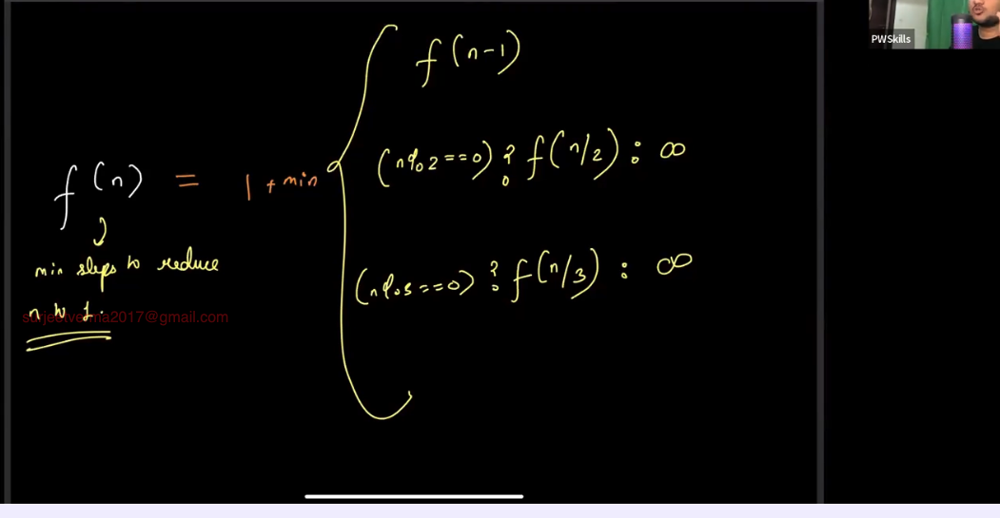
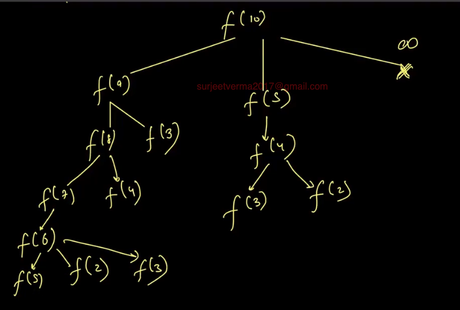

### DP

Link: https://www.geeksforgeeks.org/count-number-binary-strings-without-consecutive-1s/
Q1. Given a number n count the number of binary strings of length n without consecutive 1
ex: n=3 -> 5 {000,001,010,100,101}

n=1->2 {0,1}
n=2->3 {00,01,10}
n=3 -> 5 {000,001,010,100,101}
n=4 ->8 {0000,0001,0010,0101,0100,1000,1010,0101}

f(n)=f(n-1)+f(n-2)

Q2. Friend pairing problem:
Link: https://www.geeksforgeeks.org/count-number-binary-strings-without-consecutive-1s/

https://www.geeksforgeeks.org/friends-pairing-problem/

f(n) = f(n - 1) + (n - 1) \* f(n - 2)
proof: A,B,C,D here D have two choice (i D decide to go single, ii D decide to pair up with any one)

f(n)=returns the no. of ways such that n friends can go party
f(n-1) = when nth friend decided to go single
nth decision to pair -> nth friend can choose any one from the remaining (n-1) friends. nth friend can choose in (n-1)C1 ways and remaining will go in f(n-2) ways
so
f(n) = f(n - 1) + (n - 1) \* f(n - 2)

```CPP
#include <bits/stdc++.h>
using namespace std;

int f(n){
    if(n<=2) return n;
    return f(n-1)+(n-1)*f(n-2);

}

int main(){
    int n;
    cin>>n;
    cout<<f(n)<<endl;
    return 0;
}
```

#### Q3. Lexicographical numbers

Link: https://leetcode.com/problems/lexicographical-numbers/description/

i->10*i+0,10*i+1,10*i+2.....10*i+9

- f(i,n)=prints the number in the range i to n in lexicographical order, ifi!=0
  f(i,n)={f(10*i+0,n),f(10*i+1,n).....f(10*i+9)} or f(10*i+j,n) for all j [0,9] if i!=0
  f(i,n)={f(10*i+1,n),f(10*i+2,n).....f(10*i+9)} or f(10*i+j,n) for all j [1,9] if i==0

```CPP
class Solution {
public:
vector<int> res;
    void f(int i,int n){
        if(i>n) return ;
        if(i<=n and i!=0){
            // cout<<i<<" ";
            res.push_back(i);
        }
        if(i!=0){
            for(int j=0;j<=9;j++){
                f(10*i+j,n);
            }
        }else{
           for(int j=1;j<=9;j++){
                f(10*i+j,n);
            }
        }

    }
    vector<int> lexicalOrder(int n) {
        res.clear();
        f(0,n);
        return res;
    }
};
```

```CPP
class Solution {
public:
vector<int> res;
    void f(int i,int n){
        if(i>n) return ;
        if(i<=n and i!=0){
            // cout<<i<<" ";
            res.push_back(i);
        }
        // if(i!=0){
        //     for(int j=0;j<=9;j++){
        //         f(10*i+j,n);
        //     }
        // }else{
        //    for(int j=1;j<=9;j++){
        //         f(10*i+j,n);
        //     }
        // }
        for(int j=(i==0)?1:0;j<=9;j++){
            f(10*i+j,n);
        }

    }
    vector<int> lexicalOrder(int n) {
        res.clear();
        f(0,n);
        return res;
    }
};
```

#### Q5. House Robber

Link:https://leetcode.com/problems/house-robber/

Top down

```CPP
class Solution {
public:
    vector<int> dp;
    int f(vector<int> & arr, int i){
        int n=arr.size();
        if(i==n-1){
            dp[n-1]=arr[n-1];
            return arr[n-1];
        }
        if(i==n-2) {
            dp[n-2]=max(arr[n-2],arr[n-1]);
            return dp[n-2];
        }
        if(dp[i]!=-1){
            return dp[i];
        }

        return dp[i]=max(arr[i]+f(arr,i+2),f(arr,i+1));
    }
    int rob(vector<int>& nums) {
        int n=nums.size();
        dp.clear();
        dp.resize(n+1,-1);
        return f(nums,0);
    }
};
```

Bottom up

```CPP
class Solution {
public:
    vector<int> dp;
    int f(vector<int> & arr, int i){
        int n=arr.size();
        if(i==n-1){
            dp[n-1]=arr[n-1];
            return arr[n-1];
        }
        if(i==n-2) {
            dp[n-2]=max(arr[n-2],arr[n-1]);
            return dp[n-2];
        }
        if(dp[i]!=-1){
            return dp[i];
        }

        return dp[i]=max(arr[i]+f(arr,i+2),f(arr,i+1));
    }
    int fbottomup(vector<int> &arr){
        int n=arr.size();
        if(n==1) return arr[0];
        dp.clear();
        dp.resize(n);
        dp[n-1]=arr[n-1];
        dp[n-2]=max(arr[n-1],arr[n-2]);
        for(int i=n-3;i>=0;i--){
            dp[i]=max(arr[i]+dp[i+2],dp[i+1]);
        }
        return dp[0];
    }
    int rob(vector<int>& nums) {
        int n=nums.size();
        dp.clear();
        dp.resize(n+1,-1);
        // return f(nums,0);
        return fbottomup(nums);
    }
};
```

#### Qn.6

- Given a number n, you can perform any of the following ops on it some no. of times.

1. Reduce n to n-1
2. If n is divisible by 2 to make it n/2
3. If n is divisible by 3 make it n/3

- Find out in how many minimum steps you can reduce n to 1?
- 
- 
- 

```CPP
#include <iostream>
#include <vector>
#define inf INT_MAX
using namespace std;
int f(int n) {
    if(n == 1) return 0;
    if(n == 2 or n == 3) return 1;
    return 1 + min({f(n-1), (n%2 == 0) ? f(n/2) : inf, (n%3 == 0) ? f(n/3) : inf});
}

vector<int> dp;

int ftd(int i) {
    // Time: O(n) Space: O(n)
    if(i == 1) return 0;
    if(i == 2 or i == 3) return 1;
    if(dp[i] != -1) return dp[i]; // nth state is precomputed
    // if dp[n] is -1, we need to compute first time this state
    return dp[i] = 1 + min({ftd(i-1), (i%2 == 0) ? ftd(i/2) : inf, (i%3 == 0) ? ftd(i/3) : inf});
}

int fbu(int n) {
    // Time: O(n) Space: O(n)
    dp.clear();
    dp.resize(n+1, -1);
    dp[1] = 0;
    dp[2] = dp[3] = 1;
    for(int i = 4; i <= n; i++) { // order
        dp[i] = 1 + min({dp[i-1], (i%2 == 0) ? dp[i/2] : inf, (i%3 == 0) ? dp[i/3] : inf});
    }
    return dp[n];
}


int main() { // n -> 1000
    int n;
    cin>>n;
    dp.clear();
    dp.resize(1005, -1);
    cout<<ftd(n)<< " "<<fbu(n)<< "\n";
    return 0;
}
```
