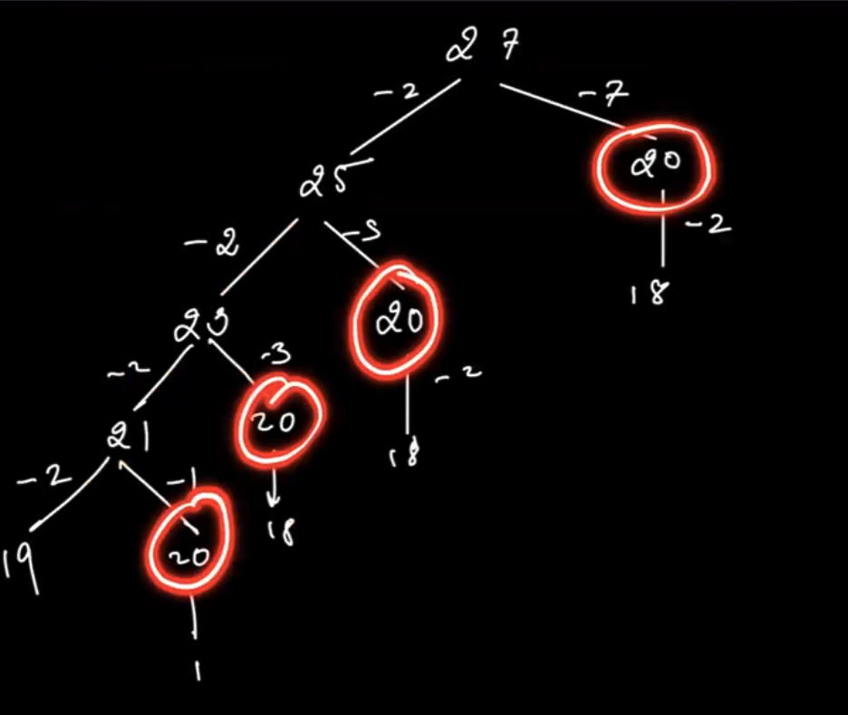

#### Q1. Removing digits CSES

Link: https://cses.fi/problemset/task/1637




```CPP
#include <iostream>
#include <vector>
#include <climits>
using namespace std;

vector<int> get_digits(int n) {
    vector<int> result;
    while(n > 0) {
        if(n % 10 != 0) {
            // n%10 is the last digit
            result.push_back(n%10);
        }
        n = n / 10;
    }
    return result;
}

vector<int> dp;

int f(int n) {
    if(n == 0) return 0;
    if(n <= 9) return 1;
    if(dp[n] != -1) return dp[n];
    vector<int> d = get_digits(n);

    int result = INT_MAX;
    for(int i = 0; i < d.size(); i++) {
        result = min(result, f(n - d[i]));
    }
    return dp[n] = 1 + result;
}

int fbu(int num) {
    dp[0] = 0;
    for(int i = 1; i <= 9; i++) dp[i] = 1;
    for(int n = 10; n <= num; n++) {
        // n -> state
        // calc dp[n]
        vector<int> d = get_digits(n);
        int result = INT_MAX;
        for(int i = 0; i < d.size(); i++) {
            result = min(result, dp[n - d[i]]);
        }
        dp[n] = 1 + result;
    }
    return dp[num];
}

int main() {
    int n;
    cin>>n;
    dp.resize(1000005, -1);
    cout<<fbu(n)<<"\n";
    return 0;
}
```

#### Q2. Minimizing coins

Link: https://cses.fi/problemset/task/1634


