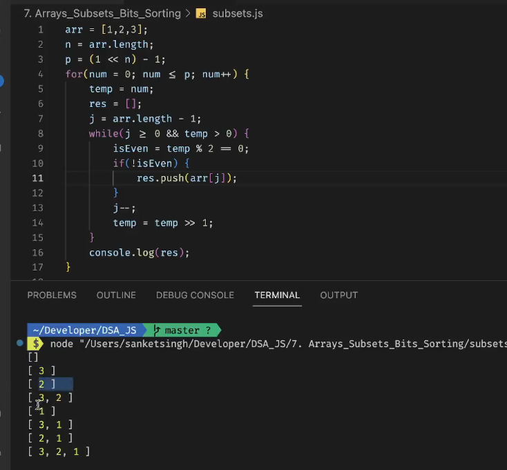

#### Q1. Number of 1 Bits

Link: https://leetcode.com/problems/number-of-1-bits/description/

Brian Kernighan's algorithm

```CPP
class Solution {
public:
    int hammingWeight(uint32_t n) {
        int count=0;
        while(n>0){
            count++;
            n=n&(n-1);
        }
        return count;

    }
};
//T=No of set bits

```

#### Q2. Sum of two integers

Link: https://leetcode.com/problems/sum-of-two-integers/description/

```CPP
class Solution {
public:
    int getSum(int a, int b) {
        return log2(pow(2,a)*pow(2,b));
        // return log2((1<<a)*(1<<b));
        //xor will give answer without carry
        //(a&b)<<1 will give one carry
        int carry;
        while(b!=0){
            carry=(a&b)<<1;
            a=a^b;
            b=carry;
        }
        return a;


    }
};
```

#### Q3. Find the ith bit in a binary representation of x

```CPP
ans=(x>>i) & 1
```

#### Q4. Subsets using Bitwise



```CPP

```
